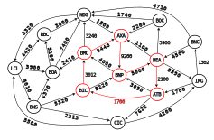
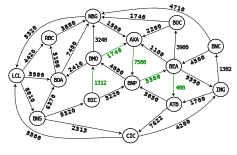
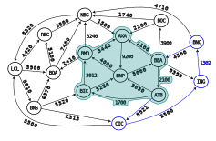
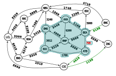

# Graph Redux - Financial Debt Network

## Overview

This repository provides an implementation and utilities for modeling financial relationships as a directed, weighted graph and for performing automated debt reductions on cycles and cooperative groups of entities. It includes a generic C++ `Digraph<T>` data structure and algorithms to detect circular debt and reduce exposures by cancelling or adjusting directed edges.

---

## Key algorithms

### Cycle reduction

Given a start institution, repeatedly find simple directed cycles that originate at that institution, reduce every edge in a discovered cycle by the cycle's minimum weight, and remove edges whose weight becomes zero.

##### Example :

A new ATB -> BIC obligation is added :

After netting, cycle reduced by the minimum obligation and the zeroed edge is removed :


### Group (cooperative) reduction

For a set of institutions, find directed paths that start at any member, leave the group immediately, and re-enter the group at any member. Reduce the path edges by the path minimum. If the path start and end differ, update or create the inter-member edge according to defined rules (increment, decrement, or create) to reflect the net transfer.

##### Example :

Initial path: ATB -> CIC -> ING -> BNC -> BEA (outbound from the cooperative) :

After netting, path reduced by the minimum obligation and the zeroed edge is removed :


---

## Requirements

- g++ (9 or 11)
- Compatible with C++11 and later

---

## Building and testing

The `src` folder contains example test drivers and a `Makefile` to build and run them.

```bash
cd src
make        # builds the test binaries
make test   # run the provided test programs
```
